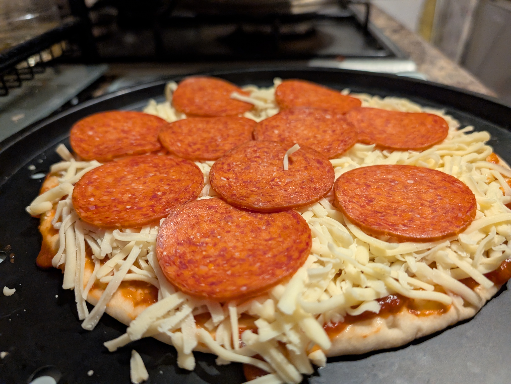
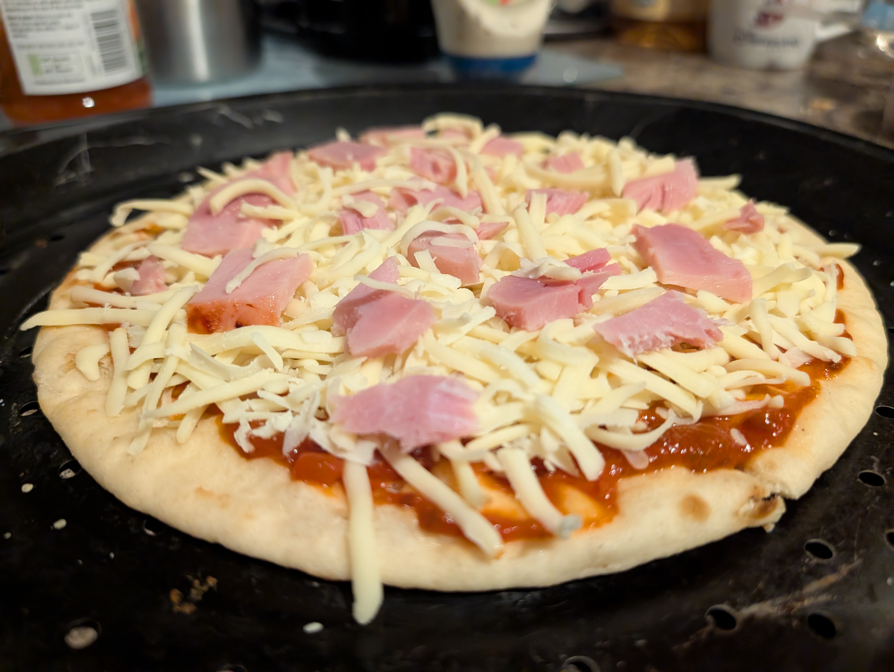
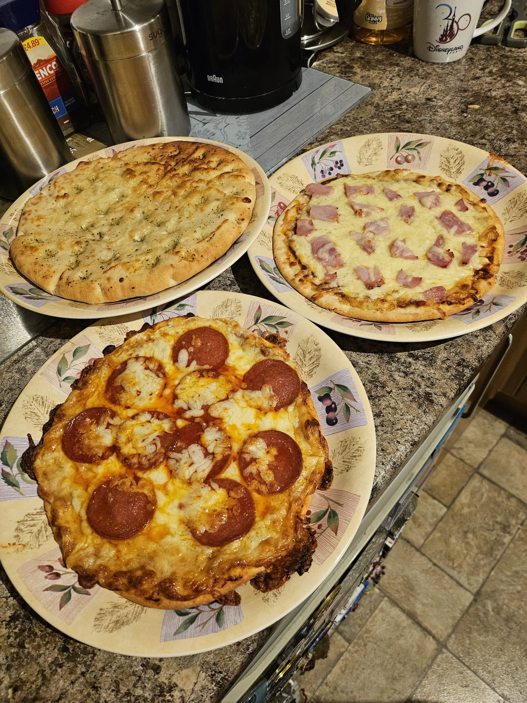

[<- Back to Main](../README.md)

# Bonus Material

To truly understand the domain I was modelling, my Fiancee gave me a real-time workshop on how to assemble and bake a pizza, and I figured, why not show you the outcome of the workshop as an easter egg?

So here is the pizza that came out of it:

For someone who would sooner burn the house down than be able to cook a half decent meal, I thought it wasn't too shabby.

Of course, my partner's one was a lot more elegant:

But then again, I could never dare to compete with them in anything culinary.

Oh, did I mention we also prepared garlic bread?

Now, it was a rather enjoyable experience. But I must say, I definitely enjoyed the experience of eating more it than I did cooking it. Still, it was a fun little thing to try, and I'm getting a slight kick out of the thought that you're probably going to order pizza tonight! :)

[<- Back to Main](../README.md)
