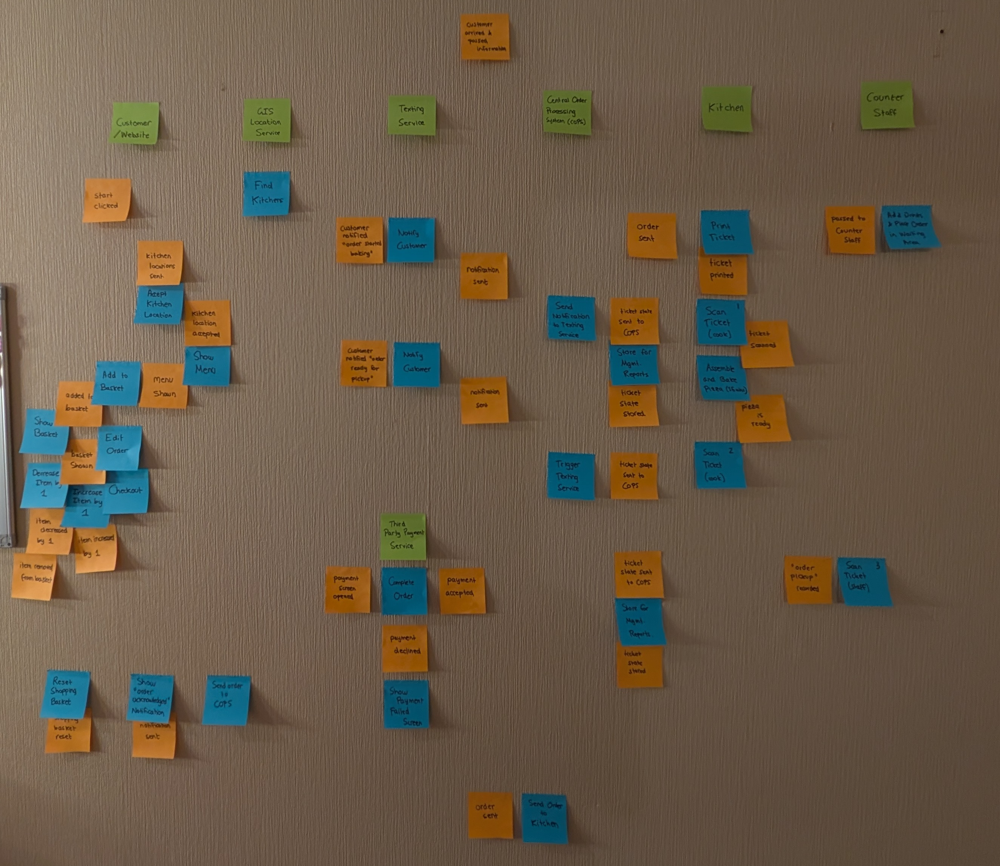

[<- Back to Main](../README.md)

# Part A: Documenting the Domain

To fully understand the flow of events and workflows in the context of the pizza ordering system domain, the first and most crucial step in the process is to build a shared mental model to represent the concepts being represented in this domain, and how they all piece together to form a cohesive whole.

To that end, the entire process was mapped on a blank wall, using green sticky notes to represent the bounded contexts, and orange and blue to represent the events and workflows that fall under that domain, respectively. This is shown in [Figure 1](./Diagrams/Figure1.jpg).


Figure 1

This process was then recreated using an online tool to more clearly represent the time and direction of these events using arrows, as represented in [Figure 2](./Diagrams/Figure2.jpg).


Figure 2

The bounded contexts are clearly marked with a white boundary, and the arrows represent the direction in which the events and workflows are travelling.
[Figure 2](./Diagrams/Figure2.jpg) illustrates that seven bounded contexts have been selected to represent this domain.

These bounded contexts, as well as the events and workflows that sit underneath them, will be explored further in this section.

## Exercise A1: Events and Workflows

In this exercise, we will explore the events and workflows that are generated in each domain, in temporal order so that the earlier events and workflows are listed first.

```
Domain: Website
    StartButtonPressed triggers FindKitchens outputs KitchenLocationsSent
    KitchenLocationAccepted triggers ShowMenu outputs MenuShown
    MenuShown triggers AddToBasket outputs AddedToBasket
    AddedToBasket triggers (ShowMenu outputs MenuShown) OR (ShowBasket outputs BasketShown)
    BasketShown triggers (EditOrder outputs MenuShown) OR (DecreaseItemBy1 outputs ItemDecreasedBy1 OR ItemRemovedFromBasket) OR IncreaseItemBy1 outputs ItemIncreasedBy1 OR Checkout outputs PaymentScreenOpened
    ShoppingBasketReset
    NotificationSent
```

```
Domain: GISLocationService
    KitchenLocationsSent triggers AcceptKitchenLocation outputs KitchenLocationAccepted
```

```
Domain: PaymentService
    PaymentScreenOpened triggers CompleteOrder outputs PaymentAccepted OR PaymentDeclined
    PaymentAccepted triggers (ResetShoppingBasket outputs ShoppingBasketReset) AND (ShowOrderAcknowledgedNotification outputs NotificationSent) AND (SendOrderToCOPS outputs OrderSent)
    PaymentDeclined triggers ShowPaymentFailedScreen outputs PaymentScreenOpened
```

```
Domain: TextingService
    CustomerNotifiedOrderStartedBaking
    CustomerNotifiedOrderReadyForPickup
```

```
Domain: COPS
    OrderSent triggers PrintTicket outputs TicketPrinted
    NotificationSent triggers NotifyCustomer outputs CustomerNotifiedOrderStartedBaking
    TicketStateStored
    NotificationSent triggers NotifyCustomer outputs CustomerNotifiedOrderReadyForPickup
    TicketStateStored
```

```
Domain: Kitchen
    TicketPrinted triggers ScanTicket outputs TicketScanned
    TicketScanned triggers AssembleAndBakePizza outputs PizzaBaked
    TicketStateSentToCops triggers (SendNotificationToTextingService outputs NotificationSent) AND (StoreForMgmtReports outputs TicketStateStored)
    PizzaBaked triggers ScanTicket outputs TicketStateSentToCOPS AND PassedToCounterStaff
    TicketStateSentToCOPS triggers SendNotificationToTextingService outputs NotificationSent
    PassedToCounterStaff triggers AddDrinks outputs DrinksAdded
```

```
Domain: CounterStaff
    DrinksAdded triggers PlaceOrderInWaitingArea outputs CustomerArrived
    CustomerArrived triggers ScanTicket outputs TicketStateSentToCOPS
    TicketStateSentToCOPS triggers StoreForMgmtReports outputs TicketStateStored
```

The domains listed above outline the various personas involved in the operation of the pizza ordering system, as well as the events that are generated within each domain, the workflows these events trigger, and the subsequent events that are generated from those workflows. These domains, events, and workflows were largely influenced by [Figure 1](./Diagrams/Figure1.jpg) and [Figure 2](./Diagrams/Figure2.jpg), which were mapped out during the event-storming session that produced it.

Now that we have determined the domains in our pizza ordering system, we need to establish the relationships between these domains. This will be covered in the next exercise.

## Exercise A2: Context Map

Establishing the relationship between our domains is crucial as large amounts of data could be passed between these entities, and we need to ensure that the data received by an entity can be processed by another entity that it has a relationship with. In enterprise systems, contracts are established between these entities which are largely subject to political and business factors. Within this assignment, we will be using the following four types of annotations on the links between these entities:

- **SK**: Shared Kernel
- **CF**: Conformist
- **CS**: Customer/Supplier
- **ACL**: Anti-Corruption Layer

Below, you will find the context map outlining the relationships between the various domains in our pizza ordering service:

```
ContextMap PizzaOrderingSystem {
	contains Website
	contains GISLocationService
	contains PaymentService
	contains TextingService
	contains COPS
	contains Kitchen
	contains CounterStaff

	Website [ACL] <-> GISLocationService
	Website [CF] <-> PaymentService
	Website [CF] -> COPS
	COPS [C] -> [S] TextingService
	Kitchen [CF] -> COPS
	Kitchen [SK] -> [SK] CounterStaff
	CounterStaff [CF] -> COPS
}
```

The `Website` domain has a bidirectional relationship with the `GISLocationService` domain as the customer enters their postcode information into the website, which is then passed to the location service, and the location service returns a list of possible kitchens for the customer to choose from on the website. The location service has an established data model, and you do not want that to corrupt the website’s domain model, so adding an **anti-corruption layer** on top of the website’s communications with the location service would be the recommended approach.

However, payment services are generally an industry standard and are subject to the regulation of a central banking system, so it is recommended that the `Website` domain take on a **conformist** approach to the relationship with the `PaymentService` domain, to align with the requirements of the regulatory bodies involved in payments systems. Similarly, the `Website` domain would take on a **conformist** approach in its relationship with the `COPS` domain, as the `COPS` system expects information related to the customer’s order that are required by the other domains, so the website would need to conform to that data model.

The relationship between the `COPS` domain and the `TextingService` domain can be compared to that of a **customer/supplier**, as the texting service is providing a service to the pizza ordering system. `COPS` provides information about the status of the order, as well as the customer’s information to the texting service so that it may be relayed to the customer, but these systems are subject to change and the texting service should be expected to conform to those changes if necessary. However, as opposed to the conformist model, the two entities can evolve independently, and the texting service is contractually obligated to comply with the data model set by `COPS`.

The `Kitchen` and `CounterStaff` domains use a similar ticketing system: when the kitchen receives a ticket and starts preparing the customer’s order, they scan the ticket several times to move the order along, and the counter staff scans the ticket to record the order being picked up and end the process. As such, there is some element of the collaboration between the two domains, and it can be assumed that they share a similar system and thus code and/or database. In that case, the **shared kernel** would be the recommended approach as any changes made in one team would require consultation from the other team.

Finally, both the `Kitchen` and the `CounterStaff` domains would take a **conformist** approach in their relationship with `COPS`, as their systems both send the ticket state to `COPS` to store information for management reports and send information to the texting service, and both these systems are expected to comply with the data model of the `COPS` system in order to do that.

## Exercise A3: Sequence Diagram for Web

Let’s delve a little deeper into how the website interacts with the COPS and third party systems by building a sequence diagram.

```
@startuml

actor Customer
participant Website
participant GISLocationService
participant PaymentService
participant COPS

Customer -> Website: Press Start Button
Website -> GISLocationService: Send Location Information
GISLocationService -> Website: Send Kitchen Locations
Customer -> Website: Accept Kitchen Location
Website -> Customer: Show Menu
Customer -> Website: Add to Basket
Customer -> Website: Show Basket
Customer -> Website: Increase Item by 1
Customer -> Website: Decrease Item by 1
Customer -> Website: Edit Order
Website -> Customer: Show Menu
Customer -> Website: Add to Basket
Customer -> Website: Show Basket
Customer -> Website: Checkout
Website -> Customer: Show Payment Screen
Customer -> Website: Complete Order
Website -> PaymentService: Send Payment Details
PaymentService -> PaymentService: Process Payment
group Payment Successful
    PaymentService -> Website: Payment Accepted
    Website -> Website: Reset Shopping Basket
    Website -> Customer: Show "Order Acknowledged" Notification
    Website -> COPS: Send Order
end

@enduml
```


Figure 3

## Exercise A4: Sequence Diagram for Kitchen

Now that we’ve explored the website, let’s look at the sequence diagram for the interactions between the kitchen, texting service, counter staff and customer, starting from when COPS receives the order.

```
@startuml

participant COPS
participant Kitchen
participant TextingService
participant CounterStaff
actor Customer

COPS -> Kitchen: Send Order
Kitchen -> Kitchen: Print Ticket
Kitchen -> Kitchen: Scan Ticket
Kitchen -> COPS: Send Ticket State
COPS -> TextingService: Send Notification
TextingService -> Customer: Notify Customer "Order Started Baking"
COPS -> COPS: Store for Mgmt Reports
Kitchen -> Kitchen: Assemble/Bake Pizza
Kitchen -> Kitchen: Scan Ticket
Kitchen -> COPS: Send Ticket State
COPS -> TextingService: Send Notification
TextingService -> Customer: Notify Customer "Order Ready for Pickup"
Kitchen -> CounterStaff: Pass Pizza
CounterStaff -> CounterStaff: Add Drinks
CounterStaff -> CounterStaff: Place Order in Waiting Area
Customer -> CounterStaff: Arrive at Kitchen
Customer -> CounterStaff: Give Information
CounterStaff -> Customer: Give Order
CounterStaff -> CounterStaff: Scan Ticket
CounterStaff -> COPS: Send Ticket State
COPS -> COPS: Store for Mgmt Reports

@enduml
```


Figure 4

[<- Back to Main](../README.md)
