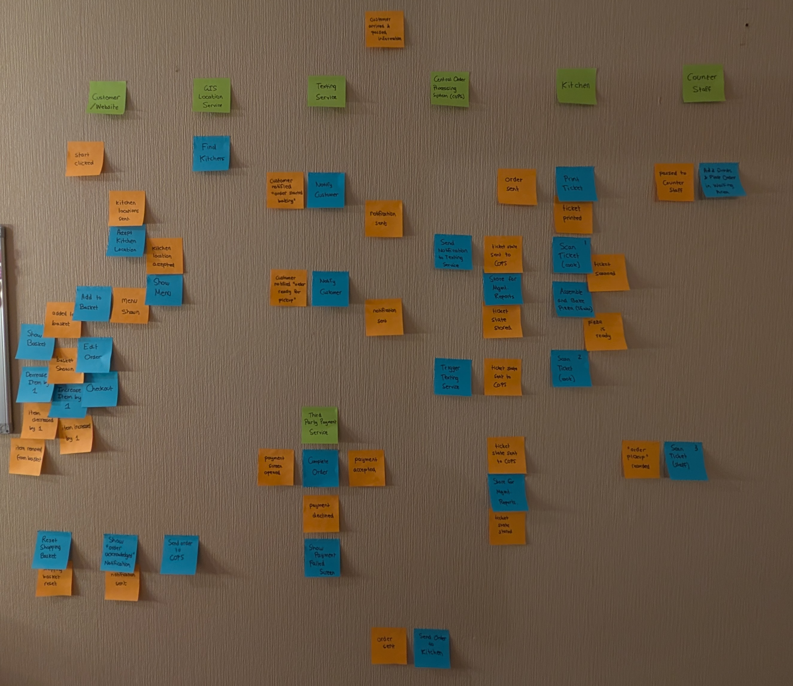
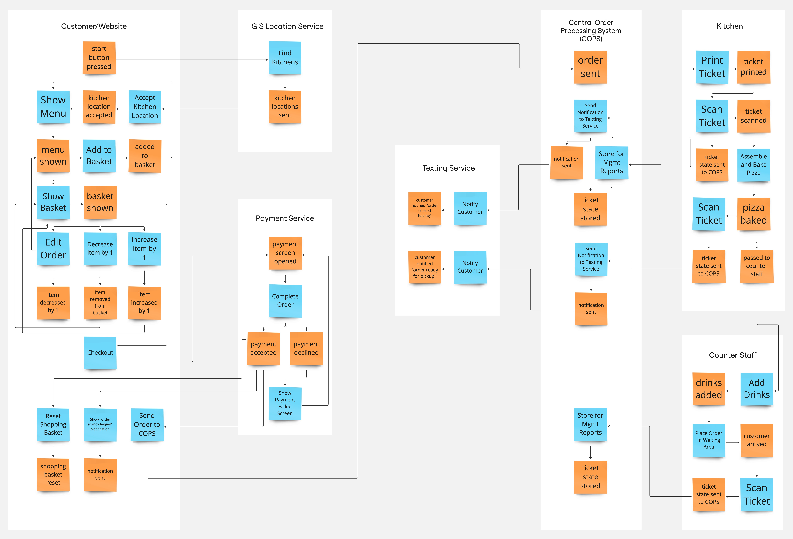
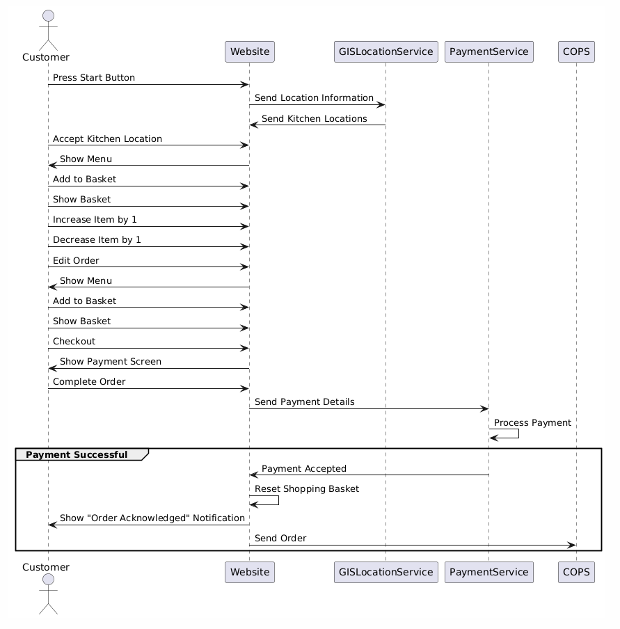
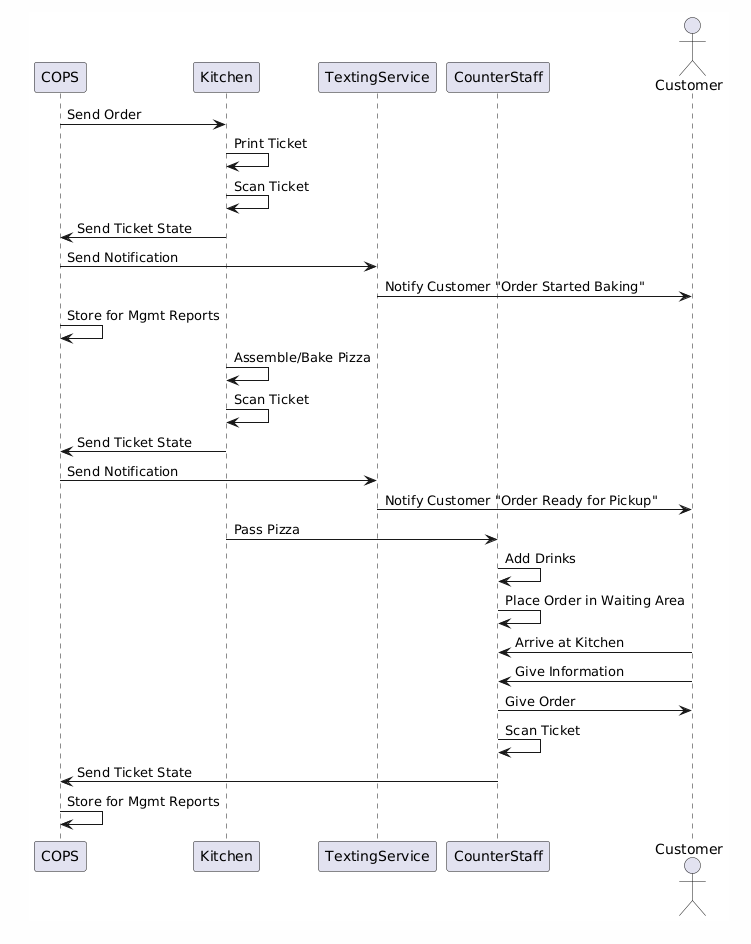

# Domain-Driven Design - Assignment

## About this File

The code in this repository makes up the DDD assignment. Each folder represents a section, and within each folder the F# files are named after each exercise. For example, anything named `B1_*` is related to `Exercise B1` in `Part B`, and so on.

This `README` is made up of code snippets and explanations, and is also organised into parts and exercises. I would recommend opening this repository in `Visual Studio Code`, and opening the markup previewer for the optimum reading experience. To do this, right click on this tab, and select `Open Preview`.

I've created this file in lieu of code comments, so that all the code and explanations are held in the same place. That being said, feel free to navigate to the individual files to execute the code. They should (hopefully) all compile.

Each section also has its own `README`, but I've compiled all the other sections into this document for ease of reading.

## Contents

- [Part A: Documenting the Domain](./PartA/README.md)
- [Part B: Modelling the Domain](./PartB/README.md)
- [Part C: Designing for Pipelines](./PartC/README.md)
- [Part D: Building a DSL for Recipes](./PartD/README.md)
- [Part E: Error Handling](./PartE/README.md)
- [Part F: Event Sourcing](./PartF/README.md)
- [Part G: Serialization](./PartG/README.md)
- [Bonus Material](./Bonus/README.md)

## Part A: Documenting the Domain

To fully understand the flow of events and workflows in the context of the pizza ordering system domain, the first and most crucial step in the process is to build a shared mental model to represent the concepts being represented in this domain, and how they all piece together to form a cohesive whole.

To that end, the entire process was mapped on a blank wall, using green sticky notes to represent the bounded contexts, and orange and blue to represent the events and workflows that fall under that domain, respectively. This is shown in [Figure 1](./Diagrams/Figure1.jpg).


Figure 1

This process was then recreated using an online tool to more clearly represent the time and direction of these events using arrows, as represented in [Figure 2](./Diagrams/Figure2.jpg).


Figure 2

The bounded contexts are clearly marked with a white boundary, and the arrows represent the direction in which the events and workflows are travelling.
[Figure 2](./Diagrams/Figure2.jpg) illustrates that seven bounded contexts have been selected to represent this domain.

These bounded contexts, as well as the events and workflows that sit underneath them, will be explored further in this section.

### Exercise A1: Events and Workflows

In this exercise, we will explore the events and workflows that are generated in each domain, in temporal order so that the earlier events and workflows are listed first.

```
Domain: Website
    StartButtonPressed triggers FindKitchens outputs KitchenLocationsSent
    KitchenLocationAccepted triggers ShowMenu outputs MenuShown
    MenuShown triggers AddToBasket outputs AddedToBasket
    AddedToBasket triggers (ShowMenu outputs MenuShown) OR (ShowBasket outputs BasketShown)
    BasketShown triggers (EditOrder outputs MenuShown) OR (DecreaseItemBy1 outputs ItemDecreasedBy1 OR ItemRemovedFromBasket) OR IncreaseItemBy1 outputs ItemIncreasedBy1 OR Checkout outputs PaymentScreenOpened
    ShoppingBasketReset
    NotificationSent
```

```
Domain: GISLocationService
    KitchenLocationsSent triggers AcceptKitchenLocation outputs KitchenLocationAccepted
```

```
Domain: PaymentService
    PaymentScreenOpened triggers CompleteOrder outputs PaymentAccepted OR PaymentDeclined
    PaymentAccepted triggers (ResetShoppingBasket outputs ShoppingBasketReset) AND (ShowOrderAcknowledgedNotification outputs NotificationSent) AND (SendOrderToCOPS outputs OrderSent)
    PaymentDeclined triggers ShowPaymentFailedScreen outputs PaymentScreenOpened
```

```
Domain: TextingService
    CustomerNotifiedOrderStartedBaking
    CustomerNotifiedOrderReadyForPickup
```

```
Domain: COPS
    OrderSent triggers PrintTicket outputs TicketPrinted
    NotificationSent triggers NotifyCustomer outputs CustomerNotifiedOrderStartedBaking
    TicketStateStored
    NotificationSent triggers NotifyCustomer outputs CustomerNotifiedOrderReadyForPickup
    TicketStateStored
```

```
Domain: Kitchen
    TicketPrinted triggers ScanTicket outputs TicketScanned
    TicketScanned triggers AssembleAndBakePizza outputs PizzaBaked
    TicketStateSentToCops triggers (SendNotificationToTextingService outputs NotificationSent) AND (StoreForMgmtReports outputs TicketStateStored)
    PizzaBaked triggers ScanTicket outputs TicketStateSentToCOPS AND PassedToCounterStaff
    TicketStateSentToCOPS triggers SendNotificationToTextingService outputs NotificationSent
    PassedToCounterStaff triggers AddDrinks outputs DrinksAdded
```

```
Domain: CounterStaff
    DrinksAdded triggers PlaceOrderInWaitingArea outputs CustomerArrived
    CustomerArrived triggers ScanTicket outputs TicketStateSentToCOPS
    TicketStateSentToCOPS triggers StoreForMgmtReports outputs TicketStateStored
```

The domains listed above outline the various personas involved in the operation of the pizza ordering system, as well as the events that are generated within each domain, the workflows these events trigger, and the subsequent events that are generated from those workflows. These domains, events, and workflows were largely influenced by [Figure 1](./Diagrams/Figure1.jpg) and [Figure 2](./Diagrams/Figure2.jpg), which were mapped out during the event-storming session that produced it.

Now that we have determined the domains in our pizza ordering system, we need to establish the relationships between these domains. This will be covered in the next exercise.

### Exercise A2: Context Map

Establishing the relationship between our domains is crucial as large amounts of data could be passed between these entities, and we need to ensure that the data received by an entity can be processed by another entity that it has a relationship with. In enterprise systems, contracts are established between these entities which are largely subject to political and business factors. Within this assignment, we will be using the following four types of annotations on the links between these entities:

- **SK**: Shared Kernel
- **CF**: Conformist
- **CS**: Customer/Supplier
- **ACL**: Anti-Corruption Layer

Below, you will find the context map outlining the relationships between the various domains in our pizza ordering service:

```
ContextMap PizzaOrderingSystem {
    contains Website
    contains GISLocationService
    contains PaymentService
    contains TextingService
    contains COPS
    contains Kitchen
    contains CounterStaff

    Website [ACL] <-> GISLocationService
    Website [CF] <-> PaymentService
    Website [CF] -> COPS
    COPS [C] -> [S] TextingService
    Kitchen [CF] -> COPS
    Kitchen [SK] -> [SK] CounterStaff
    CounterStaff [CF] -> COPS
}
```

The `Website` domain has a bidirectional relationship with the `GISLocationService` domain as the customer enters their postcode information into the website, which is then passed to the location service, and the location service returns a list of possible kitchens for the customer to choose from on the website. The location service has an established data model, and you do not want that to corrupt the website’s domain model, so adding an **anti-corruption layer** on top of the website’s communications with the location service would be the recommended approach.

However, payment services are generally an industry standard and are subject to the regulation of a central banking system, so it is recommended that the `Website` domain take on a **conformist** approach to the relationship with the `PaymentService` domain, to align with the requirements of the regulatory bodies involved in payments systems. Similarly, the `Website` domain would take on a **conformist** approach in its relationship with the `COPS` domain, as the `COPS` system expects information related to the customer’s order that are required by the other domains, so the website would need to conform to that data model.

The relationship between the `COPS` domain and the `TextingService` domain can be compared to that of a **customer/supplier**, as the texting service is providing a service to the pizza ordering system. `COPS` provides information about the status of the order, as well as the customer’s information to the texting service so that it may be relayed to the customer, but these systems are subject to change and the texting service should be expected to conform to those changes if necessary. However, as opposed to the conformist model, the two entities can evolve independently, and the texting service is contractually obligated to comply with the data model set by `COPS`.

The `Kitchen` and `CounterStaff` domains use a similar ticketing system: when the kitchen receives a ticket and starts preparing the customer’s order, they scan the ticket several times to move the order along, and the counter staff scans the ticket to record the order being picked up and end the process. As such, there is some element of the collaboration between the two domains, and it can be assumed that they share a similar system and thus code and/or database. In that case, the **shared kernel** would be the recommended approach as any changes made in one team would require consultation from the other team.

Finally, both the `Kitchen` and the `CounterStaff` domains would take a **conformist** approach in their relationship with `COPS`, as their systems both send the ticket state to `COPS` to store information for management reports and send information to the texting service, and both these systems are expected to comply with the data model of the `COPS` system in order to do that.

### Exercise A3: Sequence Diagram for Web

Let’s delve a little deeper into how the website interacts with the COPS and third party systems by building a sequence diagram.

```
@startuml

actor Customer
participant Website
participant GISLocationService
participant PaymentService
participant COPS

Customer -> Website: Press Start Button
Website -> GISLocationService: Send Location Information
GISLocationService -> Website: Send Kitchen Locations
Customer -> Website: Accept Kitchen Location
Website -> Customer: Show Menu
Customer -> Website: Add to Basket
Customer -> Website: Show Basket
Customer -> Website: Increase Item by 1
Customer -> Website: Decrease Item by 1
Customer -> Website: Edit Order
Website -> Customer: Show Menu
Customer -> Website: Add to Basket
Customer -> Website: Show Basket
Customer -> Website: Checkout
Website -> Customer: Show Payment Screen
Customer -> Website: Complete Order
Website -> PaymentService: Send Payment Details
PaymentService -> PaymentService: Process Payment
group Payment Successful
    PaymentService -> Website: Payment Accepted
    Website -> Website: Reset Shopping Basket
    Website -> Customer: Show "Order Acknowledged" Notification
    Website -> COPS: Send Order
end

@enduml
```



Figure 3

### Exercise A4: Sequence Diagram for Kitchen

Now that we’ve explored the website, let’s look at the sequence diagram for the interactions between the kitchen, texting service, counter staff and customer, starting from when COPS receives the order.

```
@startuml

participant COPS
participant Kitchen
participant TextingService
participant CounterStaff
actor Customer

COPS -> Kitchen: Send Order
Kitchen -> Kitchen: Print Ticket
Kitchen -> Kitchen: Scan Ticket
Kitchen -> COPS: Send Ticket State
COPS -> TextingService: Send Notification
TextingService -> Customer: Notify Customer "Order Started Baking"
COPS -> COPS: Store for Mgmt Reports
Kitchen -> Kitchen: Assemble/Bake Pizza
Kitchen -> Kitchen: Scan Ticket
Kitchen -> COPS: Send Ticket State
COPS -> TextingService: Send Notification
TextingService -> Customer: Notify Customer "Order Ready for Pickup"
Kitchen -> CounterStaff: Pass Pizza
CounterStaff -> CounterStaff: Add Drinks
CounterStaff -> CounterStaff: Place Order in Waiting Area
Customer -> CounterStaff: Arrive at Kitchen
Customer -> CounterStaff: Give Information
CounterStaff -> Customer: Give Order
CounterStaff -> CounterStaff: Scan Ticket
CounterStaff -> COPS: Send Ticket State
COPS -> COPS: Store for Mgmt Reports

@enduml
```



Figure 4

## Part B: Modelling the Domain

Now that we have converted the domain into a more documented format, we can start modelling it using F#.

### Exercise B1: Modelling the Menu

Let’s start by looking at the `Menu` model:

```
module Menu =

    type Topping =
        | Pepperoni
        | Ham
        | Mushrooms
        | Onions
        | Pineapple

    type PizzaName = string

    type PizzaRecipe =
        | Predefined
        | CreateYourOwn of Topping * Topping option

    type PizzaSize =
        | Large
        | Medium
        | Small

    type Pizza =
        { Name: PizzaName
          Size: PizzaSize
          Recipe: PizzaRecipe }

    type Drink =
        | Coke
        | DietCoke
        | Fanta

    type MenuItem =
        | Pizza of Pizza
        | Drink of Drink

    type Menu = MenuItem list
```

The first thing we define is the `Topping` type, which can be one of `Pepperoni`, `Ham`, `Mushrooms`, `Onions` or `Pineapple`.

Then, we define the `PizzaName` type, which will either be the “Create your own” string, or the pre-defined name such as “meat lovers pizza”, which is also a string.
Then we define the `PizzaRecipe` type, which will either be `Predefined` or a `CreateYourOwn` pizza, the latter consisting of two toppings, the second of which is optional.

Then we define the `PizzaSize`, which can either be `Large`, `Medium`, or `Small`.

Now we can define the `Pizza` type, which consists of a `Name`, a `Size`, and a `PizzaRecipe`, which we’ve defined previously.

Then we move onto `Drink`, which can either be a `Coke`, `DietCoke`, or a `Fanta`.

Finally, a `MenuItem` is either a `Pizza` or a `Drink`, and the resulting `Menu` is a list of `MenuItems`.

All the types related to `Menu` are wrapped in a module for modularity.

### Exercise B2: Modelling ShoppingBasket

Now, let’s move onto the `ShoppingBasket`:

```
module ShoppingBasket =
    open B1_Menu

    type CustomerName = CustomerName of string
    type PhoneNumber = PhoneNumber of string

    type CustomerDetails =
        { Name: CustomerName
          PhoneNumber: PhoneNumber }

    type BasketQuantity = BasketQuantity of int

    type BasketItem =
        { Item: Menu.MenuItem
          Quantity: BasketQuantity }

    type KitchenId = KitchenId of int

    type ShoppingBasket =
        { CustomerDetails: CustomerDetails
          SelectedMenuItems: BasketItem list
          KitchenId: KitchenId }
```

First, we start off by opening the `Menu` module, this allows us to access the types provided in the previous module.

Then we define the `CustomerName` and `PhoneNumber` types, which are both strings.

We then create a `CustomerDetails` type which includes the `Name`, of type `CustomerName`, and the `PhoneNumber`, of type `PhoneNumber`.

Then we model the `BasketItem`, which consists of `Item`, which is of type `MenuItem` that we created in the previous section, and `Quantity`, which is of type `ItemQuantity`.

Finally, we define the `ShoppingBasket`, which consists of `CustomerDetails`, `SelectedMenuItems` which is a list of `BasketItems`, and `KitchenId` which is an integer type.

### Exercise B3: Entities and Value Objects

Now that we’ve defined some of the models in our pizza ordering system, let’s look at some of them and determine whether they are entities, value objects, or aggregates:

- `PhoneNumber`: **Value Object**. Phone Numbers as a concept in the real world are generally unique to each individual. However, a person may upgrade their phone number or have multiple phone numbers. In that sense, they are interchangeable.
- `BasketQuantity`: **Value Object**. The `BasketQuantity` object determines how much of a particular item the customer wants to buy. There’s nothing uniquely identifiable about that quantity. Its value is in the number, and that number may change depending on how many items the customer wants to purchase.
- `ShoppingBasketItem`: **Entity**. The `ShoppingBasketItem` forms part of the order, and once that order goes through it will need to be uniquely identified by the support team. For instance, if part of the order is missing, the customer might be eligible for a full or partial refund. Hence, that item should be uniquely identifiable.
- `ShoppingBasket`: **Aggregate**. The `ShoppingBasket` is formed of many `ShoppingBasketItem` sub items, which are entities. While accessing these items are important, their identity is useless outside the context of that `ShoppingBasket` item. For instance, if a customer is eligible for a partial refund, the support team would need the identifier of the `ShoppingBasket` to be able to access the `ShoppingBasketItem` and issue the refund. So you can think of that as a top-level entity that is contained of sub-entities.

Given the observations we have provided, the `MenuItem`, `ShoppingBasketItem`, and `ShoppingBasket` entities should be updated with identifier strings, usually an id of some kind, to uniquely identify them.

We can update the `MenuItem` type accordingly:

```
    type ItemChoice =
        | Pizza of Pizza
        | Drink of Drink

    type ItemId = ItemId of int

    type MenuItem =
        { ItemId: ItemId
          ItemChoice: ItemChoice }
```

Now, the `MenuItem` type includes an `ItemId` and an `ItemChoice`, which can either be a `Pizza` or a `Drink`.

Similarly, we can update the `ShoppingBasket` accordingly:

```
module ShoppingBasket =
    open B3_Menu

    type CustomerId = CustomerId of string
    type CustomerName = CustomerName of string
    type PhoneNumber = PhoneNumber of string

    type CustomerDetails =
        { CustomerId: CustomerId
          CustomerName: CustomerName
          PhoneNumber: PhoneNumber }

    type BasketQuantity = BasketQuantity of int
    type BasketItemId = BasketItemId of int

    type BasketItem =
        { BasketItemId: BasketItemId
          Item: Menu.MenuItem
          Quantity: BasketQuantity }

    type KitchenId = KitchenId of int
    type BasketId = BasketId of int

    type ShoppingBasket =
        { BasketId: BasketId
          CustomerDetails: CustomerDetails
          SelectedMenuItems: BasketItem list
          KitchenId: KitchenId }
```

Notice that we created new types for the `BasketItemId` and `BasketId`, as well as updated `CustomerDetails` to include a `CustomerId`, as the customer is also an entity.

In the real world, information about the customer, such as their passport number or social security number, might be considered an entity to the customer, as it uniquely identifies them. However, within the kitchen, information about the customer is not relevant. The only information that becomes an entity in the kitchen is their order number, so they can pass the order to the correct customer. On the other hand, the order information is considered an entity within the kitchen, such as the menu item the customer collected, as they require that information to prepare the correct items for the customer. That information, however, is a value object to the customer. It provides value, but can change.

### Exercise B4: BasketQuantity

Now, let’s look at adding some constraints onto the basket quantity:

```
module BasketQuantity =
    type BasketQuantity = private BasketQuantity of int

    type MakeBasketQuantity = BasketQuantity -> BasketQuantity option

    let getQuantity quantity =
        match quantity with
        | BasketQuantity quantity -> quantity
```

First, we define a new module to store all our new types in, `BasketQuantity`. Then, we define the type `Quantity`, which is of type integer. We make this field private, so that it may only be created by calling the `MakeBasketQuantity` constructor and accessed by calling `getQuantity`.

Then we define the function signature for the `MakeBasketQuantity` function. This function will take in the integer, and it will output one of two things: It will either output a `BasketQuantity`, providing it passes the checks or, specifically, is an integer between 1 and 10. The other option is that it returns `None`, or nothing, if it does not passes the checks. Hence, the value is optional.

Finally, we define the `getQuantity` function, which returns the quantity value. This method is required because the quantity field is private.

We can add similar constraints to both `CustomerName` and `PhoneNumber`:

```
module CustomerName =
    type CustomerName = private CustomerName of string

    type MakeCustomerName = CustomerName -> CustomerName option

    let getName name =
        match name with
        | CustomerName name -> name
```

```
module PhoneNumber =
    open System.Text.RegularExpressions
    type PhoneNumber = private PhoneNumber of string

    type MakePhoneNumber = PhoneNumber -> PhoneNumber option

    let getNumber number =
        match number with
        | PhoneNumber number -> number
```

And add those type constraints to our `ShoppingBasket`:

```
module ShoppingBasket =
    open B3_Menu
    open B4_ConstrainedTypes.ConstrainedTypes.CustomerName
    open B4_ConstrainedTypes.ConstrainedTypes.PhoneNumber
    open B4_ConstrainedTypes.ConstrainedTypes.BasketQuantity

    type CustomerId = CustomerId of string
    type BasketItemId = BasketItemId of int
    type BasketId = BasketId of int
    type KitchenId = KitchenId of int

    type CustomerDetails =
        { CustomerId: CustomerId
          CustomerName: CustomerName
          PhoneNumber: PhoneNumber }

    type BasketItem =
        { BasketItemId: BasketItemId
          Item: Menu.MenuItem
          Quantity: BasketQuantity }

    type ShoppingBasket =
        { BasketId: BasketId
          CustomerDetails: CustomerDetails
          SelectedMenuItems: BasketItem list
          KitchenId: KitchenId }
```

### Exercise B5: ShoppingBasket Payment

We want to make it impossible to pay when the basket is empty. To implement this design, we are going to split the `ShoppingBasket` model into states. We can think of it as being in the following states:

- `EmptyBasketState`: this is before the customer adds any items into the basket.
- `ActiveBasketState`: the customer has added item(s) into the basket, but they have not paid yet.
- `PaidBasketState`: the customer has completed the payment, and now the items in the basket are part of the Order.

This is what our `ShoppingBasket` looks like now:

```
type undefined = exn

module ShoppingBasket =
    open B3_Menu
    open B4_ConstrainedTypes.ConstrainedTypes.CustomerName
    open B4_ConstrainedTypes.ConstrainedTypes.PhoneNumber
    open B4_ConstrainedTypes.ConstrainedTypes.BasketQuantity

    type CustomerId = CustomerId of string
    type BasketItemId = BasketItemId of int
    type BasketId = BasketId of int
    type KitchenId = KitchenId of int

    type Payment = undefined

    type CustomerDetails =
        { CustomerId: CustomerId
          CustomerName: CustomerName
          PhoneNumber: PhoneNumber }

    type BasketItem =
        { BasketItemId: BasketItemId
          Item: Menu.MenuItem
          Quantity: BasketQuantity }

    type ActiveBasketData =
        { BasketId: BasketId
          CustomerDetails: CustomerDetails
          SelectedMenuItems: BasketItem list
          KitchenId: KitchenId }

    type Order =
        { CustomerDetails: CustomerDetails
          SelectedMenuItems: BasketItem list
          KitchenId: KitchenId
          Payment: Payment }

    type ShoppingBasket =
        | EmptyBasketState
        | ActiveBasketState of ActiveBasketData
        | PaidBasketState of Order
```

Notice how we have added a few new types into our `ShoppingBasket`. The first among them is `Payment`, which is `undefined`. Secondly, we added `ActiveBasketData`, which contains all the information about the active shopping basket, including the customer’s details, the selected menu items, and the id of the kitchen we want the order to be sent to.
We also added the `Order`, which contains the state of the basket after the order has been paid, which includes the items in the order as well as details related to the payment.

Finally, our new `ShoppingBasket` can be in our three states: `EmptyBasketState`, which requires no additional data, `ActiveBasketState`, which includes data related to the active basket, and `PaidBasketState`, which includes details related to the order and the payment.

Now, our `Pay` function will look like this:

```
module Pay =
    open B5_ShoppingBasket.ShoppingBasket

    type Pay = ActiveBasketData -> Payment -> Order
```

The function takes in the `ActiveBasketData` and the `Payment` and returns `Order`.

### Exercise B6: Alternatives for the Design of Order

We’ve looked at different ways of managing the state of the shopping basket, by following it through the stages of being empty, active, and paid. But what about the order itself? How do we track the stages of the order once it has been made? We can refactor the order type to achieve this.

This is what the `Order` type looks like now:

```
type Order =
    { CustomerDetails: CustomerDetails
        SelectedMenuItems: BasketItem list
        KitchenId: KitchenId
        Payment: Payment }
```

We have information about the customer, the menu items the customer has selected, the kitchen the order will be picked up from, and information about the payment.

Let’s refactor that further:

```
module OrderAlt =
    open B6_ShoppingBasket.ShoppingBasket

    type OrderId = OrderId of int
    type DateTime = System.DateTime
    type PaidAmount = PaidAmount of float
    type PaidTime = PaidDate of DateTime
    type PreparingTime = PreparingTime of DateTime
    type ReadyTime = ReadyTime of DateTime
    type CompletedTime = CompletedTime of DateTime

    type Payment =
        { PaidAmount: PaidAmount
          PaidTime: PaidTime }

    type PaidOrder =
        { OrderId: OrderId
          CustomerDetails: CustomerDetails
          SelectedMenuItems: BasketItem list
          KitchenId: KitchenId
          Payment: Payment }

    type PreparingOrder =
        { OrderId: OrderId
          CustomerDetails: CustomerDetails
          SelectedMenuItems: BasketItem list
          KitchenId: KitchenId
          PreparingTime: PreparingTime }

    type ReadyOrder =
        { OrderId: OrderId
          CustomerDetails: CustomerDetails
          SelectedMenuItems: BasketItem list
          KitchenId: KitchenId
          ReadyOrder: ReadyTime }

    type CompletedOrder =
        { OrderId: OrderId
          CustomerDetails: CustomerDetails
          SelectedMenuItems: BasketItem list
          KitchenId: KitchenId
          CompletedTime: CompletedTime }

    type Order =
        | Paid of PaidOrder
        | Preparing of PreparingOrder
        | Ready of ReadyOrder
        | Completed of CompletedOrder
```

First, let’s introduce a few new types. Since the `Order` object is an entity that needs to be tracked throughout its lifecycle, let’s add an `OrderId` type. We also want to track the date and time that the order was paid, started preparing, became ready, and completed, so we added a few types to track them by using the built-in `System.DateTime` library.

Now, we can split our `Order` type into four distinct states: `PaidOrder`, `PreparingOrder`, `ReadyOrder`, and `CompletedOrder`. When the customer is checks out from the `ShoppingBasket`, the state will be `ActiveBasketState` in the `ShoppingBasket`, and we track information about the customer, and the items in the basket. Then when the user makes a payment, it moves to the `PaidOrder` state in `Order`, which adds information about the payment. We’ve created a new `Payment` type to include the `PaidAmount` and the `PaidTime`.

Next, when the cook scans the ticket and picks up the order, it moves into the `PreparingOrder` stage, and the time the ticket was scanned is logged in the `PreparingTime` field and a notification is sent to the customer. When the order has finished baking, the cook scans the ticket again, and it moves into the `ReadyOrder` state, logging the time the order was ready.

Finally, the counter staff adds the drinks and scans the ticket again when the customer picks up the order, and the order can move to the last stage, `CompletedOrder`. This takes all the information about the payment and the times the ticket was scanned, so it can be stored for management reports.

This is what the `ShoppingBasket` looks like now:

```
type ShoppingBasket =
    | EmptyBasketState of ActiveBasketData
    | ActiveBasketState of ActiveBasketData
```

Now that we’ve created the types for the various states, you might notice a few things. First among them is that a lot of information is being passed around between the states that doesn’t need to be. And the second is that people generally refer to the order as having a status, and the model we created for `Order` doesn’t reflect that.

So, we can refactor our `Order` type even further:

```
module Order =
    open B6_ShoppingBasket.ShoppingBasket

    type OrderId = OrderId of int
    type DateTime = System.DateTime
    type PaidAmount = PaidAmount of float
    type PaidTime = PaidDate of DateTime
    type PreparingTime = PreparingTime of DateTime
    type ReadyTime = ReadyTime of DateTime
    type CompletedTime = CompletedDate of DateTime

    type Payment =
        { PaidAmount: PaidAmount
          PaidTime: PaidTime }

    type PaidOrderInfo = { OrderId: OrderId; Payment: Payment }

    type PreparingOrderInfo =
        { OrderId: OrderId
          PreparingTime: PreparingTime }

    type ReadyOrderInfo =
        { OrderId: OrderId
          ReadyTime: ReadyTime }

    type CompletedOrderInfo =
        { OrderId: OrderId
          Payment: Payment
          PreparingTime: PreparingTime
          ReadyTime: ReadyTime
          CompletedTime: CompletedTime }

    type OrderStatus =
        | Paid of PaidOrderInfo
        | Preparing of PreparingOrderInfo
        | Ready of ReadyOrderInfo
        | Completed of CompletedOrderInfo

    type Order =
        { OrderId: OrderId
          CustomerDetails: CustomerDetails
          SelectedMenuItems: BasketItem list
          KitchenId: KitchenId
          Status: OrderStatus }
```

Firstly, notice that throughout each stage, we’re only capturing information relevant to that stage. Secondly, we created a new type, `OrderStatus`, which tracks the lifecycle of the order and captures information relevant to that state. And finally, all the information relevant to the order, such as the customer’s details, the items in the basket, and the kitchen, is only referenced once in the `Order` type, where we also include the `Status` of that order.

This allows our new model to be more concise, cleaner, and easier to read.

### Exercise B7: Order Must Have Items

To make our `Pay` function a total function, we need to ensure that all inputs to the function correspond to an output. This means that any state that may result in an exception being raised must be handled in such a way that it’s accounted for and may return `None`.

Let’s look at what this means for our `Payment` type:

```
type PayFailedTime = PayFailedTime of DateTime
type PayFailedReason = PayFailedReason of string

type PaymentSuccessInfo =
    { PaidAmount: PaidAmount
        PaidTime: PaidTime }

type PaymentFailedInfo =
    { PayFailedTime: PayFailedTime
        PayFailedReason: PayFailedReason }

type PaymentStatus =
    | Success of PaymentSuccessInfo
    | Failed of PaymentFailedInfo

type Payment = { Status: PaymentStatus }
```

To account for payments not going through, we refactored the `Payment` type to include a `PaymentStatus`, which might either be a `Success` or `Failed`, and information associated with both of those states.

That way, we’re constraining the input into the `Pay` function to ensure that the order does not go through if the payment is unsuccessful.

Finally, let’s look at what this will now look like for our `Pay` function:

```
module BasketTransitions =
    open B6_ShoppingBasket.ShoppingBasket
    open B7_Order.Order

    type Pay = ActiveBasketData -> Payment -> Order
```

By constraining both of the inputs: that of `ActiveBasketData` by ensuring that the state transitions to `PaidOrder` only if the `ShoppingBasket` is in the `ActiveBasketState`, and `Payment` by ensuring it progresses only when it is in the `Success` state, we ensure that every input to the `Pay` function corresponds to an output, rendering it a total function.

Here are all the event transitions for the shopping basket:

```
type InitBasket = BasketId -> CustomerDetails -> BasketItem -> KitchenId -> ShoppingBasket

type AddToBasket = BasketItem -> ActiveBasketData -> ShoppingBasket

type RemoveFromBasket = BasketItem -> ActiveBasketData -> ShoppingBasket

type Pay = ActiveBasketData -> Payment -> Order
```

## Part C: Designing for Pipelines

Now that we’ve modelled our menu and shopping basket, let’s look at how we can use pipelines to add and remove items from the basket.

To implement the `addToBasket` functionality so that we can use it in a pipeline, first a few things must be implemented, starting with the type constraints.

First, we implemented the type constraint for `BasketQuantity`, ensuring it only returns a quantity if the value is between 1 and 10:

```
let MakeBasketQuantity (qty: int) =
    if qty >= 1 && qty <= 10 then
        Some(BasketQuantity qty)
    else
        None
```

Secondly, we only allow the `CustomerName` to be a string of characters 50 characters or less:

```
let MakeCustomerName (name: string) =
    if name.Length <= 50 then Some(CustomerName name) else None
```

Finally, we added a regular expression to match the customer’s `PhoneNumber` against, so that it matches the _07 123 456789_ format:

```
let MakePhoneNumber (number: string) =
    let isValid =
        Regex.IsMatch(
            number,
            "^(((\+44\s?\d{4}|\(?0\d{4}\)?)\s?\d{3}\s?\d{3})|((\+44\s?\d{3}|\(?0\d{3}\)?)\s?\d{3}\s?\d{4})|((\+44\s?\d{2}|\(?0\d{2}\)?)\s?\d{4}\s?\d{4}))(\s?\#(\d{4}|\d{3}))?$"
        )

    if isValid then Some(PhoneNumber number) else None
```

Then, we implemented the `initBasket` function we defined in the previous section:

```
let initBasket: InitBasket =
    fun (basketId: BasketId) (customerDetails: CustomerDetails) (kitchenId: KitchenId) ->
        let activeData: ActiveBasketData =
            { BasketId = basketId
                CustomerDetails = customerDetails
                SelectedMenuItems = []
                KitchenId = kitchenId }

        EmptyBasketState activeData
```

This takes in the information about the basket, as well as the customer’s details and kitchen id, and created an `ActiveBasketData` object. In then wraps it in an `EmptyBasketState` and returns it as a `ShoppingBasket` object.

We also implement the `addToBasket` function:

```
let addToBasket: AddToBasket =
    fun (basketItem: BasketItem) (activeBasketData: ActiveBasketData) ->
        let newBasketItems: BasketItem list =
            basketItem :: activeBasketData.SelectedMenuItems

        let newBasketData =
            { BasketId = activeBasketData.BasketId
                CustomerDetails = activeBasketData.CustomerDetails
                SelectedMenuItems = newBasketItems
                KitchenId = activeBasketData.KitchenId }

        ActiveBasketState newBasketData
```

This takes the `basketItem`, as well as the `shoppingBasket`, and extracts the `activeBasketData` from the `shoppingBasket` by calling a helper function. It then prepends the new item to the current list of menu items. Then it creates a new object with the new item added to `SelectedMenuItems`, and returns that as a `ShoppingBasket` object in the `ActiveBasketState` state.

This is the `extractBasketData` helper function:

```
let extractBasketData: ExtractBasketData =
    fun (shoppingBasket: ShoppingBasket) ->
        match shoppingBasket with
        | EmptyBasketState activeBasketData -> activeBasketData
        | ActiveBasketState activeBasketData -> activeBasketData
```

This function takes in the `shoppingBasket` and, in both empty and active states, returns basket data associated with that basket.

Finally, we can create a `TestSuite`, that creates test objects based on all the types we have created thus far.

First we initialize the empty basket:

```
module TestSuite =
    open C1_ShoppingBasket.ShoppingBasket
    open C1_ConstrainedTypes.ConstrainedTypes.CustomerName
    open C1_ConstrainedTypes.ConstrainedTypes.PhoneNumber
    open C1_ConstrainedTypes.ConstrainedTypes.BasketQuantity
    open B3_Menu.Menu
    open C1_BasketImplementation.BasketImplementation


    // Initialise empty basket

    let basketId: BasketId = BasketId 1

    let customerId: CustomerId = CustomerId 1
    let customerName: CustomerName option = MakeCustomerName "John Smith"
    let phoneNumber: PhoneNumber option = MakePhoneNumber "074658392"

    let customerDetails: CustomerDetails =
        { CustomerId = customerId
          CustomerName = customerName
          PhoneNumber = phoneNumber }

    let kitchenId: KitchenId = KitchenId 1

    let emptyBasket: ShoppingBasket = initBasket basketId customerDetails kitchenId
```

We call the `initBasket` function we initialized using the test data we created here.

Then we initialize the first menu item, which is a pepperoni pizza:

```
    // Initialise menu item 1

    let pizzaName: PizzaName = PizzaName "Pepperoni Feast"
    let pizzaSize: PizzaSize = Large
    let PizzaRecipe: PizzaRecipe = Predefined

    let pepperoniPizza: Pizza =
        { Name = pizzaName
          Size = pizzaSize
          Recipe = PizzaRecipe }

    let coke: Drink = Coke

    let itemId1: ItemId = ItemId 1

    let itemChoice1: ItemChoice = Pizza pepperoniPizza

    let menuItem1: MenuItem =
        { ItemId = itemId1
          ItemChoice = itemChoice1 }

    let basketItemId1: BasketItemId = BasketItemId 1
    let quantityItem1: BasketQuantity option = MakeBasketQuantity 1

    let basketItem1: BasketItem =
        { BasketItemId = basketItemId1
          Item = menuItem1
          Quantity = quantityItem1 }
```

And then the second menu item, which is a coke:

```
    // Initialise menu item 2

    let itemId2: ItemId = ItemId 2

    let itemChoice2: ItemChoice = Drink coke

    let menuItem2: MenuItem =
        { ItemId = itemId2
          ItemChoice = itemChoice2 }

    let basketItemId2: BasketItemId = BasketItemId 2
    let quantityItem2: BasketQuantity option = MakeBasketQuantity 2

    let basketItem2: BasketItem =
        { BasketItemId = basketItemId2
          Item = menuItem2
          Quantity = quantityItem2 }
```

So we can finally use the pipeline below:

```
    emptyBasket
    |> addToBasket basketItem1
    |> addToBasket basketItem2
```

### Exercise C1: RemoveFromBasket Type

In pipeline-oriented programming, the output of the first item in the pipeline is fed as the last argument of the second argument, and so on.

Suppose we wanted to add two items to the basket and then remove one, like this:

```
emptyBasket
|> addToBasket basketItem1
|> addToBasket basketItem2
|> removeFromBasket basketItem1
```

`addToBasket` will accept the `BasketItem` and `ShoppingBasket` and then output the `ShoppingBasket`. In that case, the `ShoppingBasket` would need to be the last argument passed into the `removeFromBasket` function.

In that case, **design 1** would be a better design, as it takes `MenuItem` as the first argument and `ShoppingBasket` as the second argument and returns `ShoppingBasket`. If we went with design 2, which takes in `MenuItem` as the last argument, it will cause a compile-time error, as it’s expecting an object of type `MenuItem` but is instead receiving an object of type `ShoppingBasket`.

So it should look like this:

```
type RemoveFromBasket = MenuItem -> ShoppingBasket -> ShoppingBasket
```

### Exercise C2: Designing Debug

If we try and add the function that the developer created into the pipeline, we will receive runtime errors, because `addToBasket` is expecting an input of type `ShoppingBasket`, but instead is receiving a `unit` type because `printfn` returns a unit when printing a string.

To fix this, we would simply need to return the `shoppingBasket` in the `debug` function to ensure it can be passed along to the next `addToBasket` function.

Our `debug` function would now look like this:

```
let debug (shoppingBasket: ShoppingBasket) =
    printfn "Debugging: %A" shoppingBasket
    shoppingBasket
    : ShoppingBasket
```

So that our pipeline now looks like this:

```
emptyBasket
|> debug
|> addToBasket basketItem1
|> debug
|> addToBasket basketItem2
|> debug
```

That way, we can debug our pipeline at every step of the way and ensure that the information that needs to be passed along are being passed.

### Exercise C3: Adapting an Existing Function for a Pipeline

Suppose we want to apply a discount to the shopping basket at checkout and include that method in our existing pipeline. First, we would need to update our existing domain to include pricing of our menu items:

```
type ItemPrice = float

type MenuItem =
    { ItemId: ItemId
        ItemChoice: ItemChoice
        ItemPrice: ItemPrice }
```

We’ve added an `ItemPrice` type to our `Menu` to reflect the fact that each item has a corresponding price.

That way, we can include a `TotalPrice` field in the `ActiveBasketData`, which will be calculated by performing a sum of all the individual item prices:

```
type TotalPrice = TotalPrice of float

type ActiveBasketData =
    { BasketId: BasketId
        CustomerDetails: CustomerDetails
        SelectedMenuItems: BasketItem list
        KitchenId: KitchenId
        TotalPrice: TotalPrice }
```

In our implementation, we would need to update `AddToBasket` to calculate the total price of the basket whenever a new item is added into the basket:

```
let addToBasket: AddToBasket =
    fun (basketItem: BasketItem) (shoppingBasket: ShoppingBasket) ->

        let activeBasketData: ActiveBasketData = extractBasketData shoppingBasket

        let newBasketItems: BasketItem list =
            basketItem :: activeBasketData.SelectedMenuItems

        let totalPrice: TotalPrice = calculateTotalPrice newBasketItems

        let newBasketData: ActiveBasketData =
            { BasketId = activeBasketData.BasketId
                CustomerDetails = activeBasketData.CustomerDetails
                SelectedMenuItems = newBasketItems
                KitchenId = activeBasketData.KitchenId
                TotalPrice = totalPrice }

        ActiveBasketState newBasketData
```

After the new basket items to be added into the basket are extracted from the `shoppingBasket`, we call a helper function that calculates the total price and include it in our `newBasketData` object which is returned from the function.

Here is the helper function that calculates the total price:

```
let calculateTotalPrice: CalculateTotalPrice =
    fun (itemList: BasketItem list) ->
        let mutable totalPrice: float = 0

        for basketItem: BasketItem in itemList do
            let itemPrice: float = basketItem.Item.ItemPrice
            totalPrice <- totalPrice + itemPrice

        TotalPrice totalPrice
```

The function takes in a list of `BasketItem`s and iterates through the list, adding the price of the item to the total price, before returning it wrapped in a `TotalPrice` object.

And finally, we implement the `DiscountLibrary` function that applies the discount to the shopping basket:

```
module DiscountLibrary =
    open C3_ShoppingBasket.ShoppingBasket
    open C3_BasketImplementation.BasketImplementation

    type DiscountPercent = int
    type SetDiscountPercent = ShoppingBasket -> DiscountPercent -> ShoppingBasket
    type ExtractPrice = TotalPrice -> float
    type SetDiscountPercent2 = DiscountPercent -> ShoppingBasket -> ShoppingBasket
    type SetDiscountPercentWrapper = SetDiscountPercent -> DiscountPercent -> ShoppingBasket -> ShoppingBasket

    let extractPrice: ExtractPrice =
        fun (totalPrice: TotalPrice) ->
            match totalPrice with
            | TotalPrice price -> price

    let setDiscountPercent: SetDiscountPercent =
        fun (shoppingBasket: ShoppingBasket) (discountPercent: DiscountPercent) ->
            let activeBasketData: ActiveBasketData = extractBasketData shoppingBasket
            let totalPrice: float = extractPrice activeBasketData.TotalPrice
            let discountedTotalPrice: float = (float discountPercent * 100.0) * totalPrice

            let newBasketData: ActiveBasketData =
                { BasketId = activeBasketData.BasketId
                  CustomerDetails = activeBasketData.CustomerDetails
                  SelectedMenuItems = activeBasketData.SelectedMenuItems
                  KitchenId = activeBasketData.KitchenId
                  TotalPrice = TotalPrice discountedTotalPrice }

            ActiveBasketState newBasketData
```

The `setDiscountPercent` function extracts the basket data from the shopping basket, and the total price (using helper functions), and applies the discount to the total price. It then adds that back to the object and returns it as a `ShoppingBasket` object.

Now, when we try to add the `setDiscountPercent` function to our existing pipeline, so that it looks like this:

```
emptyBasket
|> addToBasket basketItem1
|> setDiscountPercent 10
|> addToBasket basketItem2

```

It causes a compile-time error because it is expected an input of type `ShoppingBasket` as the last parameter, as that is what is being outputted from the `addToBasket` function.

Let’s implement a second function, `setDiscountPercent2` that corrects this:

```
let setDiscountPercent2: SetDiscountPercent2 =
    fun (discountPercent: DiscountPercent) (shoppingBasket: ShoppingBasket) ->
        let activeBasketData: ActiveBasketData = extractBasketData shoppingBasket
        let totalPrice: float = extractPrice activeBasketData.TotalPrice
        let discountedTotalPrice: float = (float discountPercent * 100.0) * totalPrice

        let newBasketData: ActiveBasketData =
            { BasketId = activeBasketData.BasketId
                CustomerDetails = activeBasketData.CustomerDetails
                SelectedMenuItems = activeBasketData.SelectedMenuItems
                KitchenId = activeBasketData.KitchenId
                TotalPrice = TotalPrice discountedTotalPrice }

        ActiveBasketState newBasketData
```

We simply swap the order of the two parameters so that `shoppingBasket` is the last parameter, allowing it to fit into our existing pipeline:

```
emptyBasket
|> addToBasket basketItem1
|> setDiscountPercent2 10
|> addToBasket basketItem2
```

This will now compile without any errors.

What if we specifically want to call `setDiscountPercent` in our pipeline? We can create a generic wrapper function that accepts arguments in the correct order, and call the `setDiscountPercent` function, regardless of the order of its arguments:

```
let setDiscountPercentWrapper: SetDiscountPercentWrapper =
    fun (setDiscountPercent: SetDiscountPercent) (discountPercent: DiscountPercent) (shoppingBasket: ShoppingBasket) ->
        setDiscountPercent shoppingBasket discountPercent
```

Our function accepts the `setDiscountPercent` as an argument, as well as the arguments in the correct order, and is calls the function in the order which it was implemented.

Allowing us to use it in a pipeline like this:

```
emptyBasket
|> addToBasket basketItem1
|> setDiscountPercentWrapper setDiscountPercent 10
|> addToBasket basketItem2
```

This time there will be no compilation errors because it’s now accepting and returning the correct arguments.

## Part D: Building a DSL for Recipes

Let’s take a look into modelling the recipes used by the kitchen, by building a Domain Specific Language (DSL) so that we can model any recipe.

### Exercise D1: The Simple Types

First, let’s model some of the basic type used by ingredients and recipes within the DSL:

```
module SimpleTypes =

    type IngredientName = string
    type IngredientAmount = int

    type UnitMeasure =
        | Grams
        | Mils
        | Tsps
        | Tbsps

    type StepComment = string

    type UnitTemperature =
        | C
        | F

    type Temperature = int
    type TimeDuration = int

    type UnitTime =
        | Mins
        | Hours
```

Notice that we modelled the units themselves as union types. The remaining types are simple aliases such as strings and integers that will be used throughout the DSL.

### Exercise D2: Ingredients

Now, let’s look at modelling the `Ingredient` itself:

```
module Ingredient =
    open D1_SimpleTypes.SimpleTypes

    type Ingredient =
        | Thing of IngredientAmount * IngredientName
        | Stuff of IngredientAmount * UnitMeasure * IngredientName
```

We define `Ingredient` as a union type of tuples to store information related to them within `Ingredient`, using the types we defined in the previous section.

### Exercise D3: Recipes

Let’s look at modelling the `Recipe` and `RecipeStep` types:

```
module Recipe =
    open D1_SimpleTypes.SimpleTypes
    open D2_Ingredient.Ingredient

    type AddIngredientsData =
        { Ingredients: Ingredient list
          Comment: StepComment option }

    type OvenData =
        { Temperature: Temperature
          Unit: UnitTemperature }

    type TimedData =
        { Duration: TimeDuration
          Unit: UnitTime
          Comment: StepComment }

    type RecipeStep =
        | AddIngredients of AddIngredientsData
        | FollowInstruction of StepComment
        | UseOven of OvenData
        | Timed of TimedData

    type Recipe = RecipeStep list
```

First, we model the record types to be used by the different types of steps in the recipe. Notice how we’re reusing the `StepComment` type we defined earlier. If at some point different constraints are required for different types of comments, that can be refactored.

Then we define the `RecipeStep` as a union type. Depending on the type of recipe step in the process, it will be in a different state and will require different information.

Finally, we define the `Recipe` type as a list of `RecipeStep`s.

### Exercise D4: Vocabulary Functions

Let’s look at creating some vocabulary functions to help us build out our DSL. The functions modelled and implemented below all return objects of type `RecipeStep`:

```
module Vocabulary =
    open D1_SimpleTypes.SimpleTypes
    open D2_Ingredient.Ingredient
    open D3_Recipe.Recipe

    type Combine = StepComment -> Ingredient list -> RecipeStep
    type ThenAdd = StepComment -> Ingredient list -> RecipeStep
    type ThenDo = StepComment -> RecipeStep
    type BakeAt = Temperature -> UnitTemperature -> RecipeStep
    type BeatFor = TimeDuration -> UnitTime -> RecipeStep
    type CookFor = TimeDuration -> UnitTime -> RecipeStep

    let combine: Combine =
        fun (comment: StepComment) (ingredientList: Ingredient list) ->
            let addIngredientsData: AddIngredientsData =
                { Ingredients = ingredientList
                  Comment = comment }

            AddIngredients addIngredientsData

    let thenAdd: ThenAdd =
        fun (comment: StepComment) (ingredientList: Ingredient list) ->
            let addIngredientsData: AddIngredientsData =
                { Ingredients = ingredientList
                  Comment = comment }

            AddIngredients addIngredientsData

    let thenDo: ThenDo =
        fun (comment: StepComment) ->
            let stepComment: StepComment = "Then " + comment

            FollowInstruction stepComment

    let bakeAt: BakeAt =
        fun (temperature: Temperature) (unitTemperature: UnitTemperature) ->
            let ovenData: OvenData =
                { Temperature = temperature
                  Unit = unitTemperature }

            UseOven ovenData

    let beatFor: BeatFor =
        fun (timeDuration: TimeDuration) (unitTime: UnitTime) ->
            let stepComment: StepComment = "Beat for "

            let timedData: TimedData =
                { Duration = timeDuration
                  Unit = unitTime
                  Comment = stepComment }

            Timed timedData

    let cookFor: CookFor =
        fun (timeDuration: TimeDuration) (unitTime: UnitTime) ->
            let stepComment: StepComment = "Cook for "

            let timedData: TimedData =
                { Duration = timeDuration
                  Unit = unitTime
                  Comment = stepComment }

            Timed timedData
```

First, we define the function types to ensure that any implementation is conforming to the expected inputs and outputs. The functions that we create correspond to a recipe step and build out the data object required for each step.

Then it returns that object as a `RecipeStep` wrapped in the state that corresponds to that recipe step.

If there are any prefixes required for a comment in that step, it is concatenated with that comment and plugged into that data object or, in some cases, defined within the object and plugged in as is. Such as within the `beatFor` and `cookFor` functions.

### Exercise D5: Using the DSL

Before we can use the DSL we just modelled to create a recipe, we need to make a few changes to the vocabulary functions:

```
type Take = IngredientAmount -> UnitMeasure -> IngredientName -> Ingredient
type Grab = IngredientAmount -> IngredientName -> Ingredient

let take: Take =
    fun (amount: IngredientAmount) (unit: UnitMeasure) (name: IngredientName) -> Stuff(amount, unit, name)

let grab: Grab =
    fun (amount: IngredientAmount) (name: IngredientName) -> Thing(amount, name)
```

First, we define a few additional functions, `take` and `grab`. Take handles creating an `Ingredient` of type `Stuff`, and `Grab` handles creating an `Ingredient` of type `Thing`.

One more change we need to make is to the `thenAdd` function, which is to add the functionality that allows comments to be optional:

```
type ThenAdd = StepComment option -> Ingredient list -> RecipeStep

let thenAdd: ThenAdd =
    fun (comment: StepComment option) (ingredientList: Ingredient list) ->
        let addIngredientsData: AddIngredientsData =
            match comment with
            | Some comment ->
                { Ingredients = ingredientList
                    Comment = Some comment }
            | None ->
                { Ingredients = ingredientList
                    Comment = None }

        AddIngredients addIngredientsData
```

If we don’t provide a comment when calling `thenAdd`, it will not provide it when creating the `addIngredientsData` object. Otherwise, the comment will be passed to the object and returned as a `RecipeStep`.

Finally, we can create the `Recipe` object using our new DSL:

```
let chocolateCake: Recipe =
    [ combine
            "in a large bowl"
            [ take 225 Grams "flour"
            take 350 Grams "sugar"
            take 85 Grams "cocoa"
            take 2 Tsps "baking soda"
            take 1 Tsps "baking powder"
            take 1 Tsps "salt" ]
        thenDo "make a well in the centre"
        thenAdd None [ grab 2 "eggs"; take 125 Mils "oil"; take 250 Mils "milk" ]
        beatFor 2 Mins
        bakeAt 175 C
        thenDo "add icing" ]
```

## Part E: Error Handling

To model the steps that a robot would take to go through the steps to make a pizza, let's start off by creating some types:

```
module RobotState =
    type RobotStateData = string

    type RobotState =
        | NewRobotState of RobotStateData
        | OwningTicket of RobotStateData
        | AssemblingPizza of RobotStateData
        | PuttingInOven of RobotStateData
        | WaitingUntilDone of RobotStateData
        | TakingOutOfOven of RobotStateData
        | ScanningTicket of RobotStateData

    type OwnTicket = RobotState -> RobotState
    type AssemblePizza = RobotState -> RobotState
    type PutInOven = RobotState -> RobotState
    type WaitUntilDone = RobotState -> RobotState
    type TakeOutOfOven = RobotState -> RobotState
    type ScanTicket = RobotState -> RobotState
```

First, we create the `RobotStateData` type as a string, which will be used by the `RobotState` to store any additional information about the state.

Then we model the `RobotState` as a union type of various states, which indicate the current step the robot is taking to make the pizza.

Then we create a few types to model the transitions between each state. Notice that at each step it goes from a `RobotState` to another `RobotState` until the pizza is made.

Now, let's add some implementation of these functions. First we create a helper function that extracts the `RobotStateData` from the `RobotState`:

```
    let extractRobotStateData =
        fun (robotState: RobotState) ->
            match robotState with
            | NewRobotState stateData -> stateData
            | OwningTicket stateData -> stateData
            | AssemblingPizza stateData -> stateData
            | PuttingInOven stateData -> stateData
            | WaitingUntilDone stateData -> stateData
            | TakingOutOfOven stateData -> stateData
            | ScanningTicket stateData -> stateData
```

It matches the current state the robot is in and returns its `RobotStateData`.

Now let's implement the rest of the functions:

```
    let ownTicket: OwnTicket =
        fun (state: RobotState) ->
            let robotStateData: RobotStateData = extractRobotStateData state
            OwningTicket robotStateData

    let assemblePizza: AssemblePizza =
        fun (state: RobotState) ->
            let robotStateData: RobotStateData = extractRobotStateData state
            AssemblingPizza robotStateData

    let putInOven: PutInOven =
        fun (state: RobotState) ->
            let robotStateData: RobotStateData = extractRobotStateData state
            PuttingInOven robotStateData

    let waitUntilDone: WaitUntilDone =
        fun (state: RobotState) ->
            let robotStateData: RobotStateData = extractRobotStateData state
            WaitingUntilDone robotStateData

    let takeOutOfOven: TakeOutOfOven =
        fun (state: RobotState) ->
            let robotStateData: RobotStateData = extractRobotStateData state
            TakingOutOfOven robotStateData

    let scanTicket: ScanTicket =
        fun (state: RobotState) ->
            let robotStateData: RobotStateData = extractRobotStateData state
            ScanningTicket robotStateData
```

At each step in the process, the `RobotStateData` is extracted from the `RobotState`, and then wrapped in the next state to be passed along to the next `RobotState` in the pipeline.

Now we can implement the pipeline so that it looks like the following:

```
module TestSuite =
    open E_RobotState.RobotState

    let newRobotState: RobotState = NewRobotState ""

    newRobotState
    |> ownTicket
    |> assemblePizza
    |> putInOven
    |> waitUntilDone
    |> takeOutOfOven
    |> scanTicket
```

First we initialise the `newRobotState`, passing in `""` as the `RobotStateData`, then we pass it into a pipeline that takes it through all the states, calling the functions we just implemented.

### Exercise E1: Errors in Assemble

To account for errors encountered while assembling a pizza, let's start by creating a type to handle the different types of errors:

```
module RobotErrors =
    type AssembleError =
        | NotEnoughDough
        | NotEnoughSauce
```

We define the `AssembleError` type, which can either be in the `NotEnoughDough` state or the `NotEnoughSauce` state.

Before we update out `AssemblePizzaState` implementation, let's add some error information to the `RobotStateData` to simulate whether we will have any errors during the pizza assembly process:

```
type RobotStateData = { AssembleError: AssembleError option }
```

Now, we need to update our `AssemblePizza` type. The logic we want here is for the function to return `RobotState` if there are no errors during the assembly process, and `AssembleError` otherwise.

Here's what our new type will look like:

```
type AssemblePizza = RobotState -> Result<RobotState, AssembleError>
```

It will return a `Result` type which will either be `RobotState` or `AssembleError`.

Here is the implementation:

```
let assemblePizza: AssemblePizza =
    fun (state: RobotState) ->
        let robotStateData: RobotStateData = extractRobotStateData state
        let assemblingPizzaState: RobotState = AssemblingPizza robotStateData

        match robotStateData.AssembleError with
        | Some NotEnoughDough -> Error NotEnoughDough
        | Some NotEnoughSauce -> Error NotEnoughSauce
        | None -> Ok assemblingPizzaState
```

First, we extract the `RobotStateData` from the state, and then define the new `RobotState` we want to return.

Then, we check the `RobotStateData` to see if there's any errors passed in the state.

If there is `NotEnoughDough` or `NotEnoughSauce`, it will return an error with its corresponding `AssembleError` state. Otherwise it returns `Ok` with its corresponding `RobotState`.

### Exercise E2: Errors in PutInOven

To account for errors encountered while putting pizzas in the oven, let's model those errors too:

```
type OvenError =
    | NoOvens
    | TechnicalFault
```

`OvenError` can either be in the `NoOvens` or `TechnicalFault` states.

Now we can update the `RobotStateData` to include that error:

```
type RobotStateData =
    { AssembleError: AssembleError option
        OvenError: OvenError option }
```

And the `PutInOven` method to handle the different `OvenError`s:

```
type PutInOven = RobotState -> Result<RobotState, OvenError>

let putInOven: PutInOven =
    fun (state: RobotState) ->
        let robotStateData: RobotStateData = extractRobotStateData state
        let puttingInOvenState: RobotState = PuttingInOven robotStateData

        match robotStateData.OvenError with
        | Some NoOvens -> Error NoOvens
        | Some TechnicalFault -> Error TechnicalFault
        | None -> Ok puttingInOvenState

```

First we update the `PutInOven` type to return `Result<RobotState, OvenError>`, then we update the implementation to check the `RobotStateData` to see if there are any `OvenError`s. If there are, return an `Error` with the corresponding state, otherwise return `Ok` with the `RobotState` it corresponds to.

### Exercise E3: Unifying Errors

To unify our current types into a single error type, we define `KitchenError` like this:

```
type KitchenError =
    | Assemble of AssembleError
    | Oven of OvenError
```

The `Assemble` state includes all errors related to `AssembleError` and `Oven` includes all errors related to `OvenError`.

For the implementation, first we update the `RobotStateData` to include our new `KitchenError`:

```
type RobotStateData =
    { AssembleError: AssembleError option
        OvenError: OvenError option
        KitchenError: KitchenError option }
```

Then we create new function types for our updated functions:

```
type AssemblePizza_v2 = RobotState -> Result<RobotState, KitchenError>
type PutInOven_v2 = RobotState -> Result<RobotState, KitchenError>
```

> Notice how they both return the same type now, `Result<RobotState, KitchenError>`.

And finally, we create the function defitions themselves. Here is the new `assemblePizza_v2`:

```
let assemblePizza_v2: AssemblePizza_v2 =
    fun (state: RobotState) ->
        let robotStateData: RobotStateData = extractRobotStateData state
        let assemblingPizzaState: RobotState = AssemblingPizza robotStateData

        match robotStateData.KitchenError with
        | Some(Assemble assembleError) ->
            match assembleError with
            | NotEnoughDough -> Error(Assemble NotEnoughDough)
            | NotEnoughSauce -> Error(Assemble NotEnoughSauce)
        | None -> Ok assemblingPizzaState
```

Now, it matches `KitchenStateError` with `Assemble`, and then does a further match within `Assemble` to extract the specific error that occurred during the assembly process. It then returns that as an `Error`, passing in `NotEnoughDough` or `NotEnoughSauce`.

Here is the new `putInOven_v2`:

```
let putInOven_v2: PutInOven_v2 =
    fun (state: RobotState) ->
        let robotStateData: RobotStateData = extractRobotStateData state
        let puttingInOvenState: RobotState = PuttingInOven robotStateData

        match robotStateData.KitchenError with
        | Some(Oven ovenError) ->
            match ovenError with
            | NoOvens -> Error(Oven NoOvens)
            | TechnicalFault -> Error(Oven TechnicalFault)
        | None -> Ok puttingInOvenState
```

This also matches `KitchenStateError`, but in this function it also matches with `Oven` and extracts the relevant error, either `NoOven` or `TechnicalFault`, and returns that as an `Error`.

### Exercise E4: Using Result.bind and Result.map

Now that we've updated our `assemblePizza` and `putInOven` functions to have two outputs, our pipeline is going to fail, as `putInOven` is expecting one input, and `waitUntilDone`, `takeOutOfOven`, and `scanTicket` are all expecting one input.

If we try to compile this:

```
newRobotState
|> ownTicket
|> assemblePizza_v2
|> putInOven_v2
|> waitUntilDone
|> takeOutOfOven
|> scanTicket
```

It will fail. To fix this, we can make use of `Result.bind` and `Result.map` to convert the functions in our pipelines to those that can work with our new functions.

To start off with, `assemblePizza_v2` now has two outputs, and `putInOven_v2` accepts one input and has two outputs. This is where we can use `Result.bind`. If we pass `putInOven_v2` as an argument to `Result.bind`, it will call `putInOven_v2` only if there are no errors coming from `assemblePizza_v2`. Otherwise it will return an `Error`. Thus converting `putInOven_v2` to a function that can accept the two inputs provided by `assemblePizza_v2`.

On the other hand, since `putInOven_v2` now has two outputs, and the following functions are now one-track functions that accept one input `RobotState` and return one output, `RobotState`, we can use `Result.map` to convert them two two-track input and two-track output functions, since the function following the one being called is only called when the previous function returns a success case.

Putting all this together, first we update the `robotStateData` object to include our new errors:

```
let robotStateData: RobotStateData =
    { AssembleError = None
        OvenError = None
        KitchenError = None }
```

And now, this is what our new pipeline will now look like:

```
newRobotState
|> ownTicket
|> assemblePizza_v2
|> Result.bind putInOven_v2
|> Result.map waitUntilDone
|> Result.map takeOutOfOven
|> Result.map scanTicket
```

The functions will still take in `RobotState` and pass them to the next function, but they can now also handle different kind of errors that may occur either while assembling the pizza or putting it into the oven.

## Part F: Event Sourcing

Now, let's look at tracking inventory changes in the kitchen's stockroom.

### Exercise F1: Stockroom

Before we start defining the types of commands that can be taken in the stockroom, as well as the events that those commands trigger, let's first define some types:

```
module Inventory =
    type ItemBarcode = ItemBarcode of string
    type EmployeeId = EmployeeId of string
    type Timestamp = Timestamp of System.DateTime

    type InventoryChange =
        { Barcode: ItemBarcode
          StaffMember: EmployeeId
          Timestamp: Timestamp }
```

First, we define the `ItemBarcode`, `EmployeeId`, and `Timestamp` as these fields constitute the `InventoryChange` that is required by any actions related to inventory.

Then, we define the command and event themselves:

```
    type StockroomCommand =
        | AddToInventory of InventoryChange
        | UseFromInventory of InventoryChange
        | DiscardFromInventory of InventoryChange

    type StockroomEvent =
        | AddedToInventory of InventoryChange
        | UsedFromInventory of InventoryChange
        | DiscardedFromInventory of InventoryChange

```

Notice that the states defined in `StockroomCommand` are in the future tense - that's because we will be applying these commands to the state so that we may change the state. Similarly, `StockroomEvent` are in the past tense because we use events to replay the state both prior to executing the commands (if there were events prior to executing the commands), and apply the events triggered by the commands.

### Exercise F2: Replaying Events

Now, let's define the function signatures required to apply events to the state, execute commands against the state, and handle the commands:

```
type undefined = exn

module Replay =
    open F1_Inventory.Inventory

    type InventoryState = undefined

    type ApplyEvent = InventoryState -> StockroomEvent -> InventoryState
    type ExecuteCommand = StockroomCommand -> InventoryState -> StockroomEvent list
    type HandleCommand = StockroomCommand -> unit
```

First, we define the `InventoryState` type, which we will leave as `undefined`. What we would do is define an `eventStore` to store all the inventory events in. When we want to apply a command to the state, we would first need to determine what the current state of the system is.

To do this, `ApplyEvent` takes in the `InventoryState` and all the events that have taken place in the system, which is stored in the `eventStore`. We would iterate through this store, and for each event, call the `applyEvent`. The function then returns the state the system is in after applying the function. It will keep doing this for all the events in the `eventStore`, until it's done. Then the system is in the current state.

The `ExecuteCommand` takes the changes we want to make to the current state, as well as the current state of the system, and returns a list of `StockroomEvents` that will occur as a result of the command having been applied.

Finally, the `HandleCommand` is what orchestrates executing the command. It is the function that takes in the command to be executed against the current state, takes all the events from the event store and called `ApplyEvent` on each event to bring the state to the current state, and then calls the `ExecuteCommand` against the current state. It then adds the list of events output from that function back into the event store. It doesn't return anything or, in other words, `unit`.

In our case, suppose we want to discard an item from inventory. We would call `HandleCommand`, passing in `DiscardFromInventory` and the `Barcode` of the item, the `StaffMember` who wants to discard the item, and the `Timestamp` at which that barcode was scanned. It would then call `ApplyEvent` on all the events in the `eventStore`, until it reaches the current state. If the item hasn't been added to inventory, it might cause an issue. Otherwise, it can be safely thrown away. It will then store the `DiscardedFromInventory` event into the `eventStore`, and not need to return anything.

## Part G: Serialization

In order to serialize our domain object so that they may be transmitted as JSON objects over the wire, we must first convert some of our objects to Data Transfer Objects (DTOs).

### Exercise G1: Serializing Pizza

Let's start by serializing the `PizzaRecipe` and `Pizza` objects we created in our previous sections.

Let's start off with `PizzaRecipe`:

```
module PizzaDto =
    type ToppingDto =
        { tagTopping1: string
          tagTopping2: string }

    type PizzaRecipeDto = { tag: string; toppings: ToppingDto }
```

First, we have to convert our `Topping` type as it's used within the `PizzaRecipe` object. In our domain, this is what our `PizzaRecipe` looked like:

```
    type Topping =
        | Pepperoni
        | Ham
        | Mushrooms
        | Onions
        | Pineapple

    type PizzaRecipe =
        | Predefined
        | CreateYourOwn of Topping * Topping option
```

Notice that we supply two `Topping` objects, the second of which is optional. In F#, it is difficult to create `Nullable<string>`s because they're reference objects, so in our `ToppingDto` we create two `tag`s, and we can supply an empty string, `""` as the second argument if the user doesn't select a second topping.

For our choice types, we supply a `tag` field as a string, so that within `tagTopping1` the choices are `"pepperoni"`, `"ham"`, and so on. And within `PizzaRecipe` we supply a `tag` with two choices: `predefined` and `createyourown`. Similarly, if the user chooses `predefined` and doesn't require any toppings, both `tagTopping1` and `tagTopping2` can be supplied as empty strings.

Now, when we serialize `Pizza`, which looks like this in our domain:

```
type PizzaSize =
    | Large
    | Medium
    | Small

type Pizza =
    { Name: PizzaName
        Size: PizzaSize
        Recipe: PizzaRecipe }
```

Our resulting DTO will now look like this:

```
type PizzaSizeDto = { tag: string }

type PizzaDto =
    { name: string
        size: PizzaSizeDto
        recipe: PizzaRecipeDto }
```

First, we serialize the `PizzaSize` object, replacing our choices with a `tag` field of type `string`. Then, for the `Pizza` DTO, where the `Name` and `Size` referenced the aliases defined previously, they now reference `string` fields, and for the `recipe` we now reference our newly created `PizzaRecipeDto` instead of the `PizzaRecipe` defined in our domain.

### Exercise G2: Serializing MenuItem and Menu

Now, let's convert the rest of the `Menu` as a DTO object. This is what the remaining objects look like in our domain:

```
type Drink =
    | Coke
    | DietCoke
    | Fanta

type ItemChoice =
    | Pizza of Pizza
    | Drink of Drink

type ItemId = ItemId of int
type ItemPrice = float

type MenuItem =
    { ItemId: ItemId
        ItemChoice: ItemChoice
        ItemPrice: ItemPrice }

```

And this is what it looks like converted to a DTO:

```
module MenuDto =
    open G1_PizzaDto.PizzaDto

    type DrinkDto = { tag: string }

    type ItemChoiceDto = { pizza: PizzaDto; drink: DrinkDto }

    type MenuItemDto =
        { itemId: int
          itemChoice: ItemChoiceDto
          itemPrice: float }

    type MenuDto = MenuItemDto array
```

First, we create a `DrinkDto`, converting our drink choices to a `tag` field. Then, we create a `ItemChoiceDto`, using both the `PizzaDto` we defined in the previous section and our newly created `DrinkDto`.

Then, we define the `MenuItemDto`, where we convert our aliases to simple types, referencing the `ItemChoiceDto`.

Finally, we define our `MenuDto` which is an array of `MenuItemDto` objects.

Since our ultimate objective is to transfer our objects over the wire as JSON objects, serializing our domain types as DTO makes it a lot easier to convert to JSON, as it won't recognise our complex types. By converting them to DTOs in their more primitive form, we are now ready to convert them to JSON.

But first, let's implement the functions to convert our domain types to DTO objects.

### Exercise G3: Serializing from Domain Object to DTO

Let's start by defining the function signatures for the serializers:

```
module SerializePizza =
    open C3_Menu.Menu
    open G1_PizzaDTO.PizzaDto

    type PizzaToppingToDto = Topping -> string
    type PizzaRecipeToDto = PizzaRecipe -> PizzaRecipeDto
    type PizzaSizeToDto = PizzaSize -> string
    type PizzaToDto = Pizza -> PizzaDto
```

Here is the implementation for `PizzaToppingToDto`:

```
let pizzaToppingToDto: PizzaToppingToDto =
    fun (topping: Topping) ->
        match topping with
        | Pepperoni -> "pepperoni"
        | Ham -> "ham"
        | Mushrooms -> "mushrooms"
        | Onions -> "onions"
        | Pineapple -> "pineapple"
```

For each choice option, we want to return a corresponding string. `Pepperoni` becomes `"pepperoni"`, `Ham` becomes `"ham"`, and so on.

Now, let's look at `PizzaRecipeToDto`:

```
let pizzaRecipeToDto: PizzaRecipeToDto =
    fun (pizzaRecipe: PizzaRecipe) ->
        match pizzaRecipe with
        | Predefined ->
            { tag = "predefined"
                toppings = { tagTopping1 = ""; tagTopping2 = "" } }
        | CreateYourOwn(topping1, topping2) ->
            { tag = "createyourown"
                toppings =
                { tagTopping1 = pizzaToppingToDto topping1
                    tagTopping2 =
                    match topping2 with
                    | Some topping -> pizzaToppingToDto topping
                    | None -> "" } }
```

For `PizzaRecipe`, there are two choice options: `Predefined` and `CreateYourOwn`. For `Predefined`, we return the DTO object with the `tag` `"predefined"`, and two `topping` fields with empty strings, as the recipe is predefined.

For `CreateYourOwn`, we take in a tuple of `Topping`s, one of which is optional. So the way we implement it is by assigning `"createyourown"` to the tag, and for the `topping`s, we call our `pizzaToppingToDto` on both `topping`s. On the second `topping`, because it's optional, we have to match every case. If a `topping` exists, it will return the `topping`. Otherwise it will return an empty string.

Here is the implementation for `PizzaSizeToDto`:

```
let pizzaSizeToDto: PizzaSizeToDto =
    fun (pizzaSize: PizzaSize) ->
        match pizzaSize with
        | Large -> "large"
        | Medium -> "medium"
        | Small -> "small"
```

For `PizzaSizeToDto` we simply match the choice type for each `PizzaSize` with its corresponding string.

Finally, serializing our `Pizza` object:

```
let pizzaToDto: PizzaToDto =
    fun (pizza: Pizza) ->
        { name =
            let (PizzaName name) = pizza.Name
            name
            size =
            match pizza.Size with
            | Large -> { tag = pizzaSizeToDto Large }
            | Medium -> { tag = pizzaSizeToDto Medium }
            | Small -> { tag = pizzaSizeToDto Small }
            recipe = pizzaRecipeToDto pizza.Recipe }
```

First, we extract the `PizzaName` from the `Pizza` object. Then, for each `PizzaSize`, we create a DTO object, calling our `pizzaSizeToDto` function so that we can return its corresponding string, and assign it to the `tag` field.

Finally, we extract the `RecipeDto` from the `Recipe` and assign it to `recipe`.

### Exercise G4: Serializing from Domain Object to JSON

Now we can finally go ahead and convert our DTO object to JSON.

First, we define the `serializeJson` function:

```
module ToDto =
    open C3_Menu.Menu
    open G3_SerializePizza.SerializePizza
    open System.Text.Json

    let serializeJson = JsonSerializer.Serialize
```

This function is built into the language, and imported from `System.Text.Json`.

Then, we define a `Pizza` object that we want to first serialize into a DTO:

```
let pizzaName: PizzaName = PizzaName "Pepperoni Feast"
let pizzaSize: PizzaSize = Large
let PizzaRecipe: PizzaRecipe = CreateYourOwn(Pepperoni, Some Ham)

let myPizza: Pizza =
    { Name = pizzaName
        Size = pizzaSize
        Recipe = PizzaRecipe }
```

We create a `Large` `Pizza` with a custom recipe that consists of two toppings, `Pepperoni` and `Ham`.

Finally, we build a small pipeline that feeds `myPizza` into the `pizzaToDto` function we defined in the previous section, and then that DTO is fed into the `serializeJson` function we just defined:

```
myPizza |> pizzaToDto |> serializeJson
```

And the code compiles! We finally have our `Pizza` object that has been serialized, made easy to convert by being transformed into a DTO object, and converted to a JSON object which is now ready to be transmitted over the wire and made available on the website.

## Bonus Material

To truly understand the domain I was modelling, my Fiancee gave me a real-time workshop on how to assemble and bake a pizza, and I figured, why not show you the outcome of the workshop as an easter egg?

So here is the pizza that came out of it:


For someone who would sooner burn the house down than be able to cook a half decent meal, I thought it wasn't too shabby.

Of course, my partner's one was a lot more elegant:


But then again, I could never dare to compete with them in anything culinary.

Oh, did I mention we also prepared garlic bread?


Now, it was a rather enjoyable experience. But I must say, I definitely enjoyed the experience of eating it more than I did cooking it. Still, it was a fun little thing to try, and I'm getting a slight kick out of the thought that you're probably going to order pizza tonight! :)
